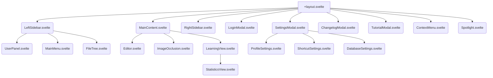

# Project Migration Plan: neurapath to SvelteKit

This document outlines the plan to migrate the neurapath application from its current vanilla JS/Electron architecture to a modern, web-only SvelteKit application using Svelte 5 and TypeScript.

## 1. Project Setup & Tooling

We will initialize a new SvelteKit project using the official CLI. All new code will be written in TypeScript to ensure type safety and improve developer experience.

-   **Package Manager**: `pnpm` will be used for efficient dependency management.
-   **SvelteKit Template**: We will start with the "Skeleton project" template and add TypeScript support during setup.
-   **Linter & Formatter**: ESLint and Prettier will be configured to maintain code quality and consistency.

## 2. Styling Architecture

The existing CSS from [`assets/css/style.css`](assets/css/style.css:1) will be refactored into a more maintainable architecture.

-   **Global Styles**: A `src/app.css` file will contain global styles, CSS variables (for themes), and resets.
-   **Component-Scoped Styles**: Most styles will be co-located with their respective Svelte components in `<style>` blocks. This ensures that styles are encapsulated and don't leak into other components.
-   **Themes**: The existing light and dark themes will be implemented using CSS custom properties. A theme store will manage the current theme and apply it to the root element.

## 3. Static Assets Migration

All static assets from the `assets/` directory will be moved to the `static/` directory in the new SvelteKit project. This includes images, icons, and fonts. SvelteKit will automatically handle serving these files.

## 4. Component Architecture

The existing UI, currently defined in [`index.html`](index.html:1), will be broken down into a hierarchy of reusable Svelte components. This will make the UI easier to manage and update.

### Proposed Component Hierarchy:

## 5. State Management & Logic Refactoring

The logic from [`assets/js/script.js`](assets/js/script.js:1) will be refactored into Svelte stores and TypeScript modules. This will decouple the application's state from the UI and improve organization.

-   **`DatabaseManager`**: Logic will be moved into a set of modules under `src/lib/services/database.ts`. This will handle all interactions with the backend API.
-   **`GraphicsManager` & `LearningManager`**: Their responsibilities will be split between Svelte components and Svelte stores (`src/lib/stores/`). For instance, UI-related logic will live in components, while application-wide state (like the current learning item) will be managed by stores.
-   **`ProfileManager`**: User profile data and settings will be managed in a dedicated `profile.store.ts`.

## 6. Routing

SvelteKit's filesystem-based router will be used to define the application's routes.

-   `src/routes/+layout.svelte`: The main layout, containing the sidebars and modals.
-   `src/routes/+page.svelte`: The main application view, which will house the editor and learning components.
-   `src/routes/login/+page.svelte`: The login page.
-   `src/routes/settings/+page.svelte`: The settings page (could be a modal or a separate route).

## 7. Library Evaluation & Replacement

Since you're open to replacing external libraries, we will evaluate modern, Svelte-native alternatives.

-   **Rich-Text Editor (Quill.js)**: We can explore using a headless component library like **Melt UI** or a dedicated Svelte rich-text editor to replace Quill.js. This will likely offer better performance and a more seamless integration.
-   **Charts (ApexCharts)**: We can replace ApexCharts with a more lightweight, Svelte-native charting library like **`svelte-frappe-charts`** or use Chart.js with a Svelte wrapper.

## 8. Authentication Flow

We will implement a secure authentication flow using SvelteKit's features.

1.  **Login**: The user will submit their credentials on the `/login` page.
2.  **API Request**: A request will be made to the backend to authenticate the user and retrieve a token.
3.  **Session Management**: The token will be stored securely (e.g., in an HTTPOnly cookie). A `hooks.server.ts` file will be used to manage the user's session on the server.
4.  **Protected Routes**: The main application routes will be protected, redirecting unauthenticated users to the login page.

## 9. Deployment

With the move away from Electron, the application can be deployed to any modern web hosting platform.

-   **Recommended Platforms**: **Vercel** and **Netlify** are excellent choices, offering seamless integration with SvelteKit, continuous deployment, and serverless functions.
-   **Build Process**: We will configure the project to build a static site or a Node.js server, depending on the need for server-side rendering.

This plan provides a high-level roadmap for the migration. We can adjust and refine it as we proceed. Do you have any questions or feedback on this plan?